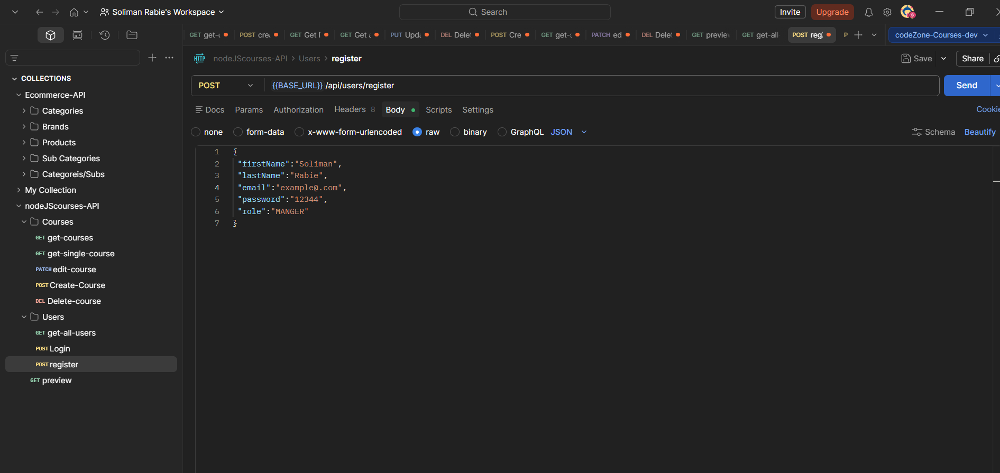
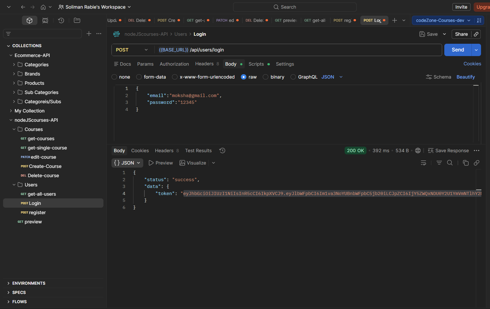
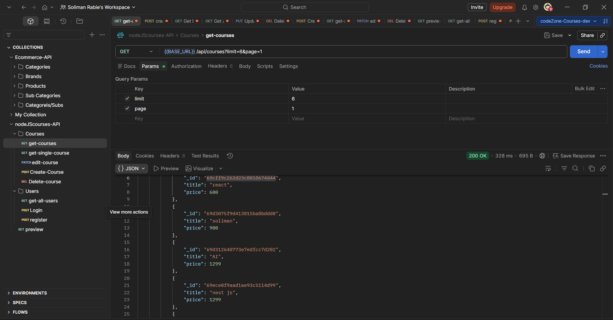
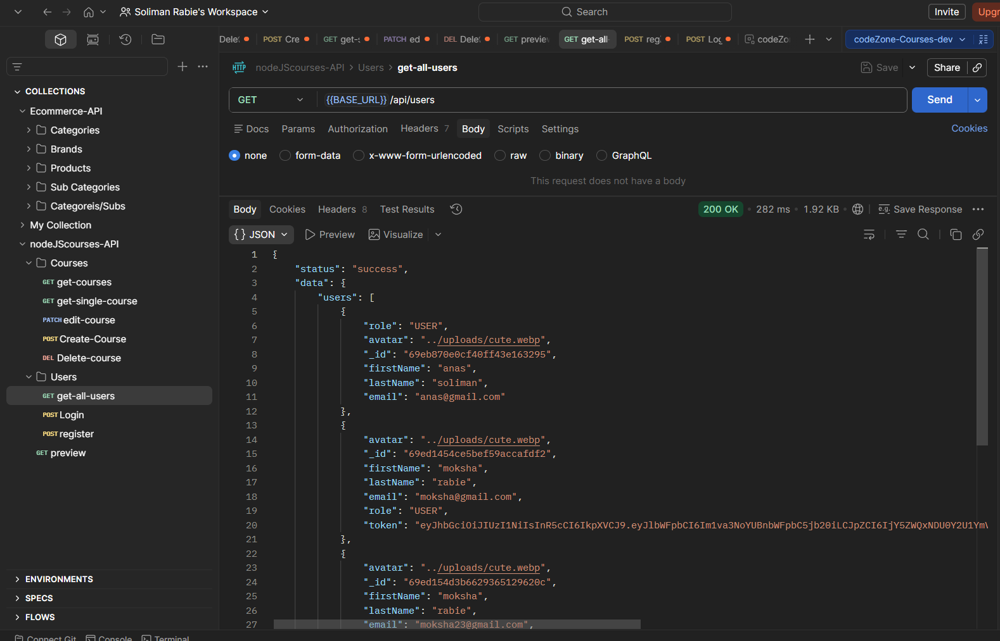
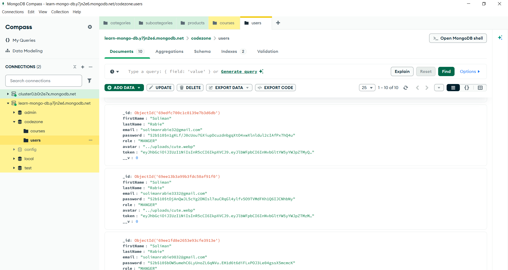
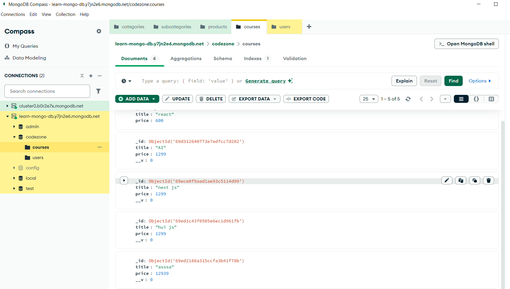

# 🚀 Learning Platform Backend API

A complete Backend REST API project built with **Node.js**, **Express.js**, and **MongoDB**.

This project simulates a mini learning platform where users can register, authenticate, manage courses, and access protected routes based on their roles.

---

# 📌 Project Idea

The application is designed as a simple learning platform backend system.

## 👤 Users can:

- Register an account
- Upload profile images
- Login securely using JWT
- Access protected routes
- Use role-based permissions

## 📚 Courses can:

- Be created by authorized users
- Be updated and deleted
- Be fetched with pagination
- Be managed through RESTful APIs

---

# 🛠️ Features

## 🔐 Authentication & Authorization

- JWT Authentication
- Role-Based Access Control
- Password Hashing using bcryptjs
- Protected Routes

## 📚 Courses API

- Create Course
- Get All Courses
- Get Single Course
- Update Course
- Delete Course

## 👤 Users API

- Register Users
- Login Users
- Upload User Avatar

## ⚙️ General Features

- Middleware Architecture
- Global Error Handling
- Async Wrapper Middleware
- Validation using express-validator
- Pagination using Query Params
- Environment Variables with dotenv
- Static File Serving
- Clean Project Structure

---

# 🧰 Tech Stack

- Node.js
- Express.js
- MongoDB
- Mongoose
- JWT
- bcryptjs
- express-validator
- Multer
- dotenv
- cors

---

# 📁 Project Structure

```bash
project/
│
├── controllers/
├── middlewares/
├── models/
├── routes/
├── uploads/
├── utils/
├── .env
├── server.js
└── package.json
```

---

# ⚙️ Installation & Setup

## 1️⃣ Clone Repository

```bash
git clone https://github.com/SolimanRabie/Monjaz-Express-Library.git
```

## 2️⃣ Navigate to Project Folder

```bash
cd Monjaz-Express-Library
```

## 3️⃣ Install Dependencies

```bash
npm install
```

## 4️⃣ Setup Environment Variables

Create a `.env` file in the root directory:

```env
MONGO_URL=your_mongodb_connection
PORT=5001
JWT_SECRET_KEY
```

## 5️⃣ Run Development Server

```bash
npm run start
```

---

# 🔐 Authentication Example

## Register User

```http
POST /api/users/register
```

## Login User

```http
POST /api/users/login
```

---

# 📚 API Endpoints

## Courses Routes

| Method | Endpoint         | Description       |
| ------ | ---------------- | ----------------- |
| GET    | /api/courses     | Get all courses   |
| GET    | /api/courses/:id | Get single course |
| POST   | /api/courses     | Create course     |
| PATCH  | /api/courses/:id | Update course     |
| DELETE | /api/courses/:id | Delete course     |

---

## Users Routes

| Method | Endpoint            | Description   |
| ------ | ------------------- | ------------- |
| GET    | /api/users          | Get all users |
| POST   | /api/users/register | Register user |
| POST   | /api/users/login    | Login user    |

---

# 🧠 Concepts Practiced

- REST APIs
- Middleware Architecture
- JWT Authentication
- Authorization & Roles
- Error Handling
- MongoDB Integration
- Validation
- File Uploads
- Pagination
- Clean Code Structure

---

# 📸 Screenshots

## 🔹 Register Endpoint

```md

```

## 🔹 Login Endpoint

```md

```

## 🔹 Get Courses Endpoint

```md

```

## 🔹 Get Users Endpoint

```md

```

## 🔹 MongoDB Database

```md


```

---

# 🚀 Future Improvements

- Refresh Tokens
- Docker Support
- API Documentation
- Unit Testing
- Deployment
- Email Verification
- Password Reset

---

# 🔗 GitHub Repository

## 👉 https://github.com/SolimanRabie/Monjaz-Express-Library

# 👨‍💻 Author

## Soliman Rabie

Backend Developer

🔗 linkedin Profile :
👉 www.linkedin.com/in/soliman-rabie-017b401b8

Feel free to connect or give feedback 🙌
